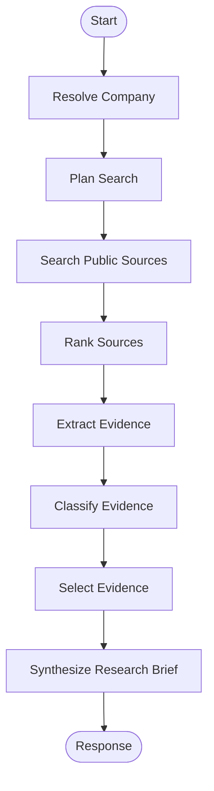

# Primer Studio

[](https://github.com/nadzic/primer-studio/actions/workflows/ci.yml)


An agentic equity-research workflow prototype for a retail investor (Primer take-home).

Given a public company name or ticker, the system produces a concise, structured brief answering:
- what changed in the latest results / reporting
- what matters most now
- the main bull points
- the main bear points
- what to watch next

It uses **public information only** and **separates facts from interpretation**. It is intentionally **not** a buy/sell recommendation engine.

## What this repo contains

### Backend (FastAPI + LangGraph)

- `company_resolver` normalizes company/ticker intent from user input.
- `search_planner` builds purpose-driven search queries.
- `public_source_searcher` retrieves public sources (Tavily) and applies policy filters.
- `source_ranker` scores and ranks sources by reliability/relevance/recency and dedupes.
- `evidence_extractor` converts source text into atomic evidence items.
- `evidence_classifier` tags evidence strength + fact/interpretation.
- `evidence_selector` keeps only useful evidence for the final brief.
- `research_synthesizer` generates final brief sections and citations.

### Frontend (Next.js)

- Chat-style UI for running the workflow.
- Optional voice dictation + transcription via `POST /api/transcribe` (ElevenLabs proxy route).

## System flow

`request -> company_resolver -> search_planner -> public_source_searcher -> source_ranker -> evidence_extractor -> evidence_classifier -> evidence_selector -> research_synthesizer -> response`



## Source prioritisation and evidence strength

- **Source ranking**: prioritises reliability (primary sources like filings / IR), relevance (latest reporting / KPIs), recency, and deduplication.
- **Evidence strength**:
  - **Strong**: primary sources or clearly grounded factual claims
  - **Medium**: reputable secondary sources / weaker grounding but still useful
  - **Weak**: speculative commentary or sentiment, included only when clearly labeled

## What I would improve with more time

- **Deeper primary-source fetching**: ingest full 10-Q/8-K/earnings transcript text for better grounding.
- **Streaming + trace UI**: stream per-node progress/events to the frontend instead of time-based progress.
- **Evals**: expand evals to include ranking/selection metrics (e.g. “top sources contain SEC/IR/transcript”).
- **Caching**: cache source discovery + fetch results to reduce latency and token spend.
- **More robust extraction**: stronger HTML→text extraction and citation spans (paragraph-level citations).

## API surface

- `GET /api/v1/health`
- `GET /api/v1/meta/model`
- `POST /api/v1/research`
- `POST /api/v1/research/followup`

Example research request:

```json
{
  "query": "Please research NVDA"
}
```

Example research response shape:

```json
{
  "company": "NVIDIA Corporation",
  "ticker": "NVDA",
  "brief": {
    "executive_summary": "...",
    "workflow_trace": [],
    "evidence_strength_rubric": [],
    "what_changed": [
      {
        "text": "...",
        "type": "fact",
        "evidence_strength": "strong",
        "evidence_id": null,
        "source_url": "https://..."
      }
    ],
    "what_matters_most_now": [],
    "bull_points": [],
    "bear_points": [],
    "what_to_watch_next": []
  },
  "evidence_quality_summary": {
    "strong": 4,
    "medium": 3,
    "weak": 1
  },
  "sources": [],
  "selected_evidence": [],
  "discarded_evidence_count": 8,
  "disclaimer": "This is not investment advice.",
  "usage": {
    "input_tokens": 0,
    "output_tokens": 0,
    "total_tokens": 0
  },
  "warning": null,
  "error": null
}
```

Example frontend-style plain-text output:

```text
NVIDIA Corporation (NVDA)
Latest reporting research brief
----------------------------------------

Executive summary
...

What changed
- Revenue grew ...

What matters most now
- ...

Bull points
- ...

Bear points
- ...

What to watch next
- ...

Evidence quality
Strong: 4 | Medium: 3 | Weak: 1

Sources used
1. ...
2. ...
3. ...

Disclaimer
This is not investment advice.
```

## Tech stack

### Backend

- Python 3.11
- FastAPI + Uvicorn
- LangGraph / LangChain
- Tavily web search (source discovery)

### Frontend

- Next.js 16
- React 19
- TypeScript

### Tooling

- `uv` for Python dependency management
- Docker + Docker Compose
- Ruff + BasedPyright + Pytest
- GitHub Actions CI

## Run locally

### 1) Backend

```bash
uv sync
uv run uvicorn app.main:app --reload --app-dir .
```

Create `.env` (copy `sample.env`) and configure at least:
- `LLM_PROVIDER` (`openai` or `anthropic`)
- `LLM_MODEL_NAME` (e.g. `gpt-4o-mini`)
- `OPENAI_API_KEY` or `ANTHROPIC_API_KEY`
- `TAVILY_API_KEY` (required for public web search)
- `ALLOWED_ORIGINS` (comma-separated; e.g. `http://localhost:3000`)

Optional:
- `LANGFUSE_PUBLIC_KEY`, `LANGFUSE_SECRET_KEY` (observability)
- `QDRANT_URL`, `QDRANT_API_KEY` (if using Qdrant-backed vector storage)
- `RATE_LIMIT_ANON_DAILY`, `RATE_LIMIT_USER_DAILY`, `RATE_LIMIT_COOKIE_SECRET` (frontend/API rate limiting)

### 2) Frontend

```bash
cd app/frontend
npm install
npm run dev
```

Set `app/frontend/.env.local`:
- `NEXT_PUBLIC_API_URL` (default `http://localhost:8000/api/v1`)
- `ELEVENLABS_API_KEY` (optional; only if using voice transcription)

### 3) Full stack with Docker

```bash
docker compose up --build
```

Useful URLs:
- API docs: `http://localhost:8000/docs`
- API health: `http://localhost:8000/api/v1/health`
- Frontend: `http://localhost:3000`

## Project structure

```text
app/
  agents/
    graph/
      nodes/
    services/
  api/
    routes/
    schemas/
  frontend/
    src/
      app/
      components/
      lib/
```

## Quality

CI checks on push to `main`:
- Ruff lint
- BasedPyright type checks
- Pytest (when tests exist)
- Python compile smoke checks
- Docker build

## Disclaimer

Educational/research project. Not financial advice.
